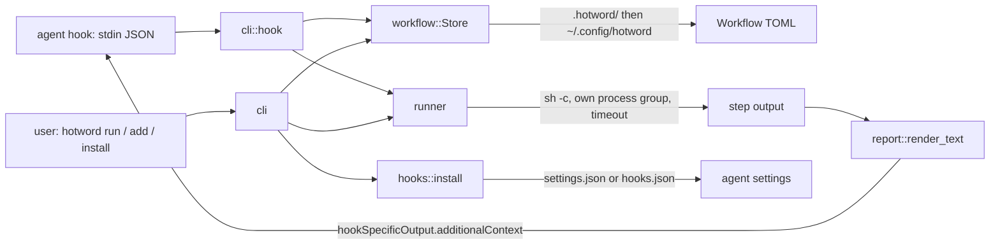

# Design

## Origin

A one-word bash hook, written against the [Claude Code hooks reference](https://code.claude.com/docs/en/hooks).
That contract (JSON in on stdin, `additionalContext` out on stdout, a 10,000 character cap, exit 2 blocks) is the whole surface this builds on.

## Problem

Every "check status" question costs the agent a round of guessing: which commands, which repo, which environment.
Several tool calls and a chunk of context go to facts a shell one-liner already knows, and every engineer pays it separately.

## Shape

One binary, four modules.

**Workflow.** A TOML file: name, trigger phrases, optional session events, ordered steps.
A repo's `.hotword/` shadows `~/.config/hotword/`, so committing a file gives the team the phrase.

**Runner.** Each step runs through `sh -c` in its own process group; a timeout kills the tree.
A missing tool or folder skips the step with a reason instead of failing the run.
All steps run even after a failure; the report is the answer.

**Report.** A summary table, then each step's output truncated to `max_lines`, capped under the agents' 10,000 character limit.

**Hooks.** Claude Code's `settings.json` and Codex's `hooks.json` share one shape, so one installer serves both.
Ours are found by their command suffix, which makes install idempotent and lets a moved binary be repaired.

**Doctor.** String rules turn a run into a verdict, a cause, and fixes per step.
The same JSON drives the terminal interface and the Mac app.

**History.** Optional. Every run is a Dolt commit; `changes` is a diff of the `latest` table.

## Decisions

- Matching is a case-insensitive substring, so `hotword match` can always say what fires.
- Hook subcommands never exit non-zero; a status workflow must never reject a prompt.
- No daemon, no cache, no database unless history is switched on.
- Every interactive field is also a flag, so an agent never lands in a prompt.
- Codex hooks need trust in `/hooks`; OpenCode has a plugin instead of an installer.

## Risks

- A slow UserPromptSubmit step stalls the prompt: 120 second hook timeout, 30 second step default.
- A step that prints a secret puts it in the transcript; the examples avoid such commands.
- The installer re-serialises settings JSON; content survives, formatting may change.

## Verification

`make test` runs 68 tests against real shell commands in temp directories, including a timeout that must kill a grandchild `sleep`, an install into a settings file with other hooks, the hook fed the agents' exact payloads, and a real Dolt repository.
Negative checks: a non-matching prompt yields empty stdout, broken stdin exits 0 with a stderr note, `--strict` turns a failed step into exit 1.
