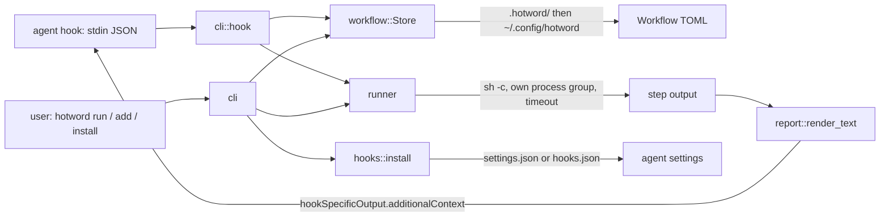

# Design

## Problem

Every "check status" question to a coding agent costs a round of guessing: which commands exist, which repo to look in, which environment. The agent spends several tool calls and a chunk of context rediscovering facts a shell one-liner already knows, and each engineer on a team rediscovers them separately.

## Shape

One binary, three concerns, four modules that do the work.

**Workflow** is a TOML file: a name, trigger phrases, optional session events, and ordered steps. The store reads a repo's `.hotword/` first so a committed workflow shadows a personal one of the same name. That is the mechanism by which a team shares behaviour: commit the file, and every member's agent gains the phrase.

**Runner** runs each step through `sh -c` in its own process group. A timeout kills the whole tree, not only the shell. A step is skipped, not failed, when its binary is not on PATH or its `cwd` is missing, because a shared workflow must degrade on a machine that lacks one tool rather than paint the whole report red. All steps run even after a failure; the report is the answer, so a failing step is information rather than an abort.

**Report** renders one compact text block: a summary table, then each step's output truncated to `max_lines`, with a hint for the untruncated form. The hook envelope caps the context under the 10,000 character limit both Claude Code and Codex enforce, so the report arrives inline rather than as a file preview.

**Hooks** edits the agent's settings file. Claude Code's `settings.json` and Codex's `hooks.json` share the `hooks.<Event>[].hooks[]` shape, so one editor serves both. Ours are identified by their command suffix, which makes install idempotent and lets a moved binary be repaired in place.

## Decisions

- Phrase matching is a case-insensitive, whitespace-normalised substring test. Regex would let a typo silently disable a workflow; substring is predictable and `hotword match` shows exactly what fires.
- Hook subcommands never exit non-zero and never print anything but the envelope. An exit 2 on UserPromptSubmit rejects the user's prompt; nothing a status workflow does should have that power.
- No daemon, no cache, no database. A workflow runs when asked and the shell is the only dependency.
- The interactive wizard is a convenience for people. Every field it asks for is also a flag, so an agent creating a workflow never lands in a prompt.
- Codex hooks require trust through `/hooks`; the installer says so rather than trying to work around it. OpenCode has a plugin API rather than command hooks, so it is documented rather than automated.

## Risks

- A slow step on UserPromptSubmit stalls the prompt. The installer sets a 120 second hook timeout and each step defaults to 30 seconds; a workflow that needs more should run at session start instead.
- A workflow that prints secrets puts them in the transcript. The examples avoid commands that print tokens, and the README says so.
- The installer re-serialises the settings JSON, so key order and whitespace may change on first install. Content is preserved; a diff after install shows only the added groups.

## Verification

`make test` runs 49 tests that execute real shell commands in temp directories, including a timeout that must kill a grandchild `sleep`, an install into a settings file that already has other hooks, and the hook subcommand fed the exact JSON the agents send. The negative checks: a non-matching prompt yields empty stdout, broken stdin exits 0 with a stderr note, and `--strict` turns a failed step into exit 1.
